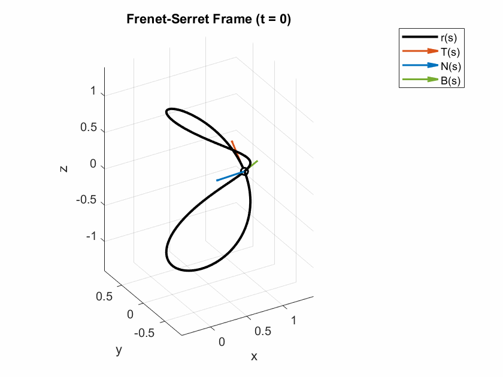
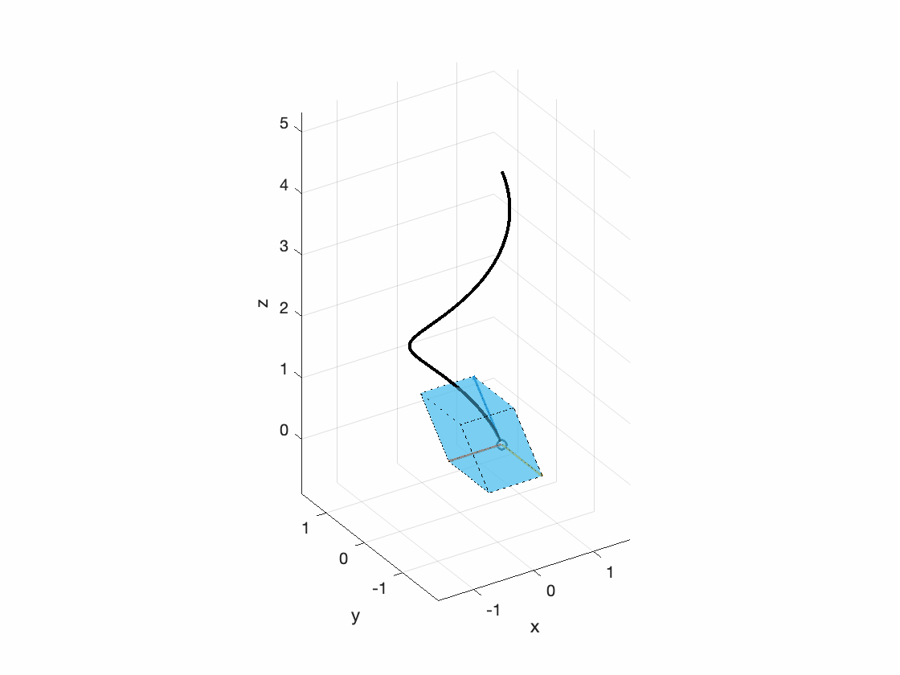

# Moving Frames 

**Curriculum Module created in collaboration with Xincheng Li, Graduate Research Assistant at University of Maryland Institute for Systems Research**  
_Created with R2022. Compatible with R2022 and later releases._ 

## Description ##
This curriculum module contains interactive [live scripts](https://www.mathworks.com/products/matlab/live-editor.html) that illustrate various examples and applications of the moving frame method. The course is divided into four modules: an introduction module and three different examples of moving frames, with the focus on curves in 2-D and 3-D. 

These lessons can be used as part of a lecture, as activities in an instructional setting, or as interactive assignments to be completed outside class.

Get started with the interactive examples by downloading and unzipping the repository. Then, double-click the Navigation.mlx file inside the Navigation folder. From there, you can follow the landing page instructions to get started with the examples. The instructions inside the live scripts will guide you through the exercises and activities. Get started with each live script by running it one section at a time. To stop running the script or a section midway (for example, if a loop is running longer than intended), click the  **Stop** button in the **RUN** section of the **Live Editor** tab in the MATLAB Toolstrip.

## Prerequisite Domain Knowledge ##
This module assumes familiarity with basic concepts from calculus and linear algebra.

## Details ##

**`Introduction.mlx`**
An interactive lesson on the definition of parametric equations, frames, and group transformations, all from the point of view of curves and trajectories as vector-valued parametric functions.

 

**In this script, students will...**
- Recognize parametric curves and identify change in parameters
- Define reference frames and understand what is a moving frame
- Learn of group transformations and matrix Lie groups 

## ##

**`Fernet_Serret_Frame.mlx`**
An interactive lesson on the Frenet Serret frame, which is the most commonly used and known moving frame method. Applications include generating trajectories using parameters like curvature and torsion in mechanical systems such as multi-link manipulators and unicycle models.

 

**In this script, students will...**
- Construct the Frenet-Serret frame of a curve and its invariants (arclength, curvature, and torsion) from its construction
- Apply the Frenet-Serret frame to the 2-link manipulator and the unicycle model
- Compute curvature and torsion of a curve by hand

**`Natural_Frenet_Frame.mlx`**
An interactive lesson on the natural Frenet frame, where its similarities and differences with the Frenet-Serret frame are compared.

 

**In this script, students will...**
- Define the natural Frenet frame of a curve and its invariants 
- Recognize the similarities and differences of the natural Frenet frame compared to the Frenet-Serret frame
- Learn the normal development plane associated with a curve 
- Apply the natural Frenet frame to computer graphics

**`Affine_Frame.mlx`**
An interactive lesson on the equi-affine frame for 2-D as well as 3-D curves, defining concepts such as affine arc-length and affine curvature. 

 

**In this script, students will...**
- Define the equi-affine frame and its invariants (affine arclength and affine curvature)
- Construct the equi-affine frame in 2-D and 3-D

## Products ##
MATLAB&reg;, Symbolic Math Toolbox&trade; 
## License ##
The license for this module is available in the [License.md](LICENSE.md) file in this GitHub repository.

## Support ##
Solutions are available upon instructor request. If you would like to request solutions or have a question, contact the <a href="mailto:onlineteaching@mathworks.com">MathWorks online teaching team.</a>

# #
_Copyright 2022-2023 The MathWorks, Inc._
